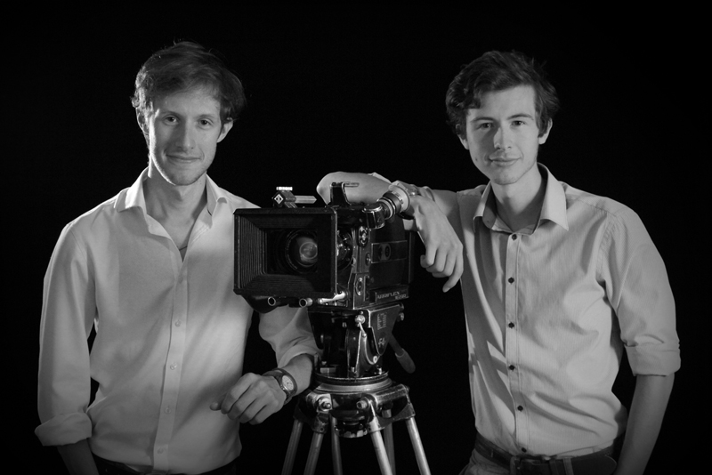

ABOUT:

Elliander Pictures is a UK based production partnership between directing brothers, Elliot Weaver (29) & Zander Weaver (26), producing both factual television and narrative dramatic content. Since 2010 the company has produced over 9 hours of factual programming for broadcasters including *Discovery, PBS, Canal+* and *UKTV* and is currently completing post production on the self produced feature film, COSMOS.

The brothers plan to continue producing documentaries but shift their focus to directing feature films, where their passion lies.

*Please Note*: This website is currently under development and more information on recent projects can be found on the company's blog <a href= "https://reeldealfilmschool.wordpress.com/projects/">here</a>.
